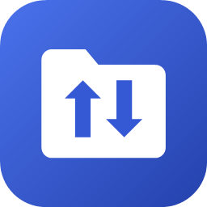
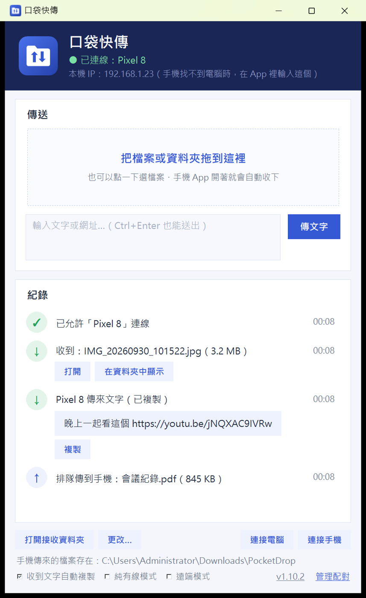
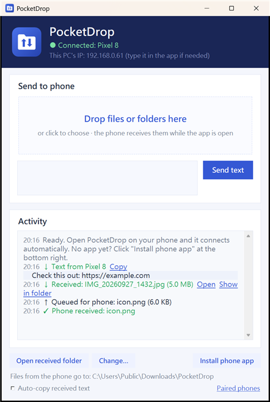

<p align="center"></p>

<h1 align="center">PocketDrop 口袋快傳</h1>

<p align="center">
手機 ↔ 電腦互傳檔案和文字：同一個 Wi-Fi、<b>一條 USB 線</b>，或在外面用<b>遠端模式</b>都行。<br>
Android 和 iPhone 都能用，不用註冊任何帳號。Android App 只有 <b>約 40 KB</b>。<br>
<a href="#english">English below</a>
</p>

<p align="center"></p>

## 特色

- **雙向傳檔：** 手機 → 電腦、電腦 → 手機，資料夾也可以；也能傳文字和網址，收到會自動複製
- **電腦對電腦：** 按「連接電腦」找到同一個網路裡的另一台電腦，對方按一次「允許」就能互傳，資料夾結構會保留；遠端模式也適用
- **手機對手機：** 手機可以選「傳給」另一支手機，由電腦幫忙轉送（Android、iPhone 混著也行，對方打開 App 或網頁就會收到）
- **一對多：** 配對好幾支手機時，可以勾選「傳給」哪幾支，一次傳給全部（Android、iPhone 混著也行）；沒開著的手機之後打開會補收
- **USB 線一插就配對：** 手機用傳輸線接電腦、開「USB 網路共用」，就自動配對，不用按任何確認；插著線時會自動改走傳輸線，沒有 Wi-Fi 也能傳
- **純有線模式：** 開了之後完全不走 Wi-Fi，Wi-Fi 上的裝置連不到、也找不到這台電腦，隱私最高
- **遠端模式（免帳號）：** 手機在外面用行動網路也能跟家裡的電腦互傳，勾一下就開
- **iPhone 不用裝 App：** 掃電腦上的 QR code，直接在 Safari 裡用；「加入主畫面」後就跟 App 一樣
- **連接手機精靈：** 第一次打開會一步步帶你連手機；Android 接上傳輸線（選「檔案傳輸」）後，電腦會自動把 App 安裝檔放進手機
- **Windows 安裝精靈：** 一般的「下一步」安裝，會建好捷徑和右鍵「傳送到」，也會替防火牆開好私人與公用網路
- **一鍵更新：** GitHub 有新版時，電腦版右上角會出現「更新」按鈕，按一下自動下載安裝（會核對校驗碼）；電腦更新後，手機 App 會跟著出現「更新 App」按鈕，iPhone 網頁版會自動換成新版
- **中英文介面：** 跟著系統語言自動切換
- **超輕量：** Android App 是純 Java，沒有任何第三方函式庫

## 下載

到 [Releases](../../releases) 下載：

| 檔案 | 說明 |
|---|---|
| `PocketDrop-Setup-x.y.z.exe` | **Windows 安裝檔（推薦）** |
| `PocketDrop.exe` | Windows 免安裝版，直接執行 |
| `PocketDrop.apk` | Android App（Android 10 以上）。也可以用電腦版的精靈裝到手機 |

iPhone 不用下載任何東西。

## 使用方法

1. 電腦執行安裝檔，裝好後會打開口袋快傳，並跳出「連接手機」精靈。
   - 這個安裝檔沒有數位簽章，如果出現「Windows 已保護您的電腦」，按「其他資訊 → 仍要執行」。
   - 如果用免安裝版，第一次開啟時 Windows 會詢問防火牆，請按「允許存取」，「私人」和「公用網路」都打勾。
2. 照精靈選手機種類：
   - **Android：** 用傳輸線接上電腦，手機選「檔案傳輸」，電腦會自動把安裝檔放進手機的「下載」資料夾，在手機上點它安裝。也可以掃 QR code 下載。
   - **iPhone：** 用相機掃 QR code，就會在 Safari 打開並自動配對。
3. 之後手機打開 App（或網頁）就會自動連上。Wi-Fi 第一次連線要在電腦上按「允許」；用 USB 線或掃 QR code 連的話，會自動配對。

收到的檔案存在：

- **電腦：** `下載\PocketDrop`（可以改）
- **Android：** `下載/PocketDrop`
- **iPhone：** 按「下載」後存在「檔案」App 的「下載項目」

### 三種連線方式

| 方式 | 怎麼開 | 適合 |
|---|---|---|
| **Wi-Fi** | 什麼都不用做 | 在家、手機和電腦在同一個 Wi-Fi |
| **USB 線** | 手機接上傳輸線，App 裡按「用 USB 線連」→ 開「USB 網路共用」 | 沒有 Wi-Fi、想要最穩最私密 |
| **遠端模式** | 電腦版勾「遠端模式」 | 手機在外面（行動網路、別的 Wi-Fi） |
| **熱點** | 電腦開熱點給手機，或手機開熱點給電腦 | 沒有 Wi-Fi 路由器的地方；用法跟 Wi-Fi 一樣 |

- **純有線模式：** 電腦版和手機 App 各有一個開關，兩邊都開最安全。開著時只接受 USB 線，遠端模式也會停用。
- **遠端模式：**
  - 用 Cloudflare 的免費臨時通道（trycloudflare.com），不用註冊。第一次開啟會下載約 60 MB 的 Cloudflare 官方元件。
  - 手機要先在家（或用傳輸線）連過一次，之後在外面就會自動連上。
  - 資料會經過 Cloudflare 的伺服器（有 HTTPS 加密）。電腦版每次重開，遠端網址都會變；Android 下次連上時會自動更新，iPhone 要重掃一次 QR code。
- **熱點：** 電腦開「行動熱點」給手機連、或手機開熱點給電腦連都可以。電腦開熱點時，如果掃 QR code 連不到，精靈裡會另外列出熱點那邊的位址（通常是 `192.168.137.1`）。手機開熱點會用到手機的行動數據。
- **更私密的遠端（進階）：** 電腦和手機都裝 [Tailscale](https://tailscale.com/) 並登入同一個帳號，口袋快傳會自動使用。資料直接加密點對點傳，不經過第三方。

## 注意事項

- 電腦傳東西到手機時，手機 App（或 iPhone 網頁）要開著；沒開的話會先排隊，打開後自動收下。
- Wi-Fi 和 USB 線走區域網路的 HTTP，**沒有另外加密**，請在自己家裡或信任的網路使用。遠端模式走 HTTPS。
- 有些公共 Wi-Fi 會擋裝置之間互連（AP 隔離），這種時候改用 USB 線或遠端模式。
- 開著 USB 網路共用時，電腦可能會透過手機的網路上網（會用到手機流量），傳完可以關掉。
- USB 自動配對和「自動把安裝檔放進手機」目前只支援 Windows。iPhone 用傳輸線開「個人熱點」也能自動配對，但電腦要先裝好 Apple 的驅動程式（例如 iTunes 或 Apple Devices）。
- Android 的安全規定不允許電腦直接替手機安裝 App（除非開了開發人員的 USB 偵錯），所以最後要在手機上按一下「安裝」。
- iPhone 網頁版的限制：網頁要開著才收得到；電腦傳來的檔案要一個一個按「下載」；沒辦法從相簿直接「分享」過去。
- 電腦版在 Windows 11 上測試過；macOS / Linux 可以用原始碼執行，但還沒實際測過（遠端模式要自己裝 `cloudflared`）。

## 從原始碼執行／打包

**電腦版**（Python 3.10+）：

```bash
pip install -r requirements.txt
python pc/pocketdrop.pyw
```

**全部打包**（Windows）：先準備好下面 Android 的工具、`pip install pyinstaller`，以及 [Inno Setup 6](https://jrsoftware.org/isinfo.php)。

```powershell
powershell -ExecutionPolicy Bypass -File build_release.ps1 -Version 1.6.0
```

這會做出 `PocketDrop.apk`、`dist\PocketDrop.exe` 和 `dist\PocketDrop-Setup-1.6.0.exe`。`pc\pocketdrop.pyw` 裡的 `APP_VERSION` 要跟 `-Version` 一樣；Android 的版本碼會自動算（1.6.0 → 10600）。

**只做 Android App：** 不需要 Android Studio 或 Gradle，只要 JDK 17 和 Android SDK 命令列工具：

1. 安裝 JDK 17。
2. 安裝 [Android command-line tools](https://developer.android.com/studio#command-tools)，再用 `sdkmanager` 裝好 `"build-tools;35.0.0"` 和 `"platforms;android-35"`。
3. 執行：

```powershell
powershell -ExecutionPolicy Bypass -File build_apk.ps1 -Tools <放 jdk-17* 和 sdk 的資料夾>
```

也可以改設 `JAVA_HOME`、`ANDROID_HOME` 環境變數。第一次打包會產生自己的簽名金鑰（`android/release.keystore`），請保存好，之後更新 App 要用同一把。

## 運作方式

- **找電腦：** 手機用 UDP 廣播 `POCKETDROP?` 到 47852 埠，電腦回覆自己的名字和 HTTP 埠（47850）。
- **連線與傳輸：** 之後全部走 HTTP。第一次連線（`/api/hello`）時電腦會跳出詢問；允許後發一把鑰匙給手機，之後每個請求都要帶。
- **電腦 → 手機：** 用長輪詢（`/api/poll`）。每一項排隊都記著要給哪幾支手機、哪幾支收過了，全部收到才移除。
- **USB 自動配對：** 手機開 USB 網路共用後，電腦會多一張 RNDIS / NCM 網卡。電腦發現連線是從這張網卡進來的，代表手機實體接在這台電腦上，就直接配對。網卡名稱比對刻意很嚴格，USB 轉乙太網路的網卡不會被誤認。
- **純有線模式：** 電腦在收到連線的第一時間（還沒回任何東西）就把非 USB 的連線關掉，UDP 搜尋也不回應。手機只在 USB 網卡上廣播。
- **遠端模式：** 電腦版執行 `cloudflared tunnel --url`，把拿到的網址放在 `/api/ping`、`/api/poll` 的回應裡，手機記住後，在外面找不到電腦時就改連它。Cloudflare 每次上傳最多 100 MB，所以上傳一律切成 32 MB 一段（`uid` + `offset`）。從通道進來的連線不能用本機專用的功能。
- **更新：** 電腦版問 GitHub 的 `releases/latest`，下載對應的檔案並核對 GitHub 提供的 SHA-256。安裝版用新的安裝檔靜默安裝（`/SILENT`）；免安裝版等程式關掉後換掉 exe。手機 App 從 `/api/ping`、`/api/poll` 的 `apk` 欄位知道電腦帶著哪一版，比自己新就從電腦下載，交給系統的 PackageInstaller 安裝。
- **電腦對電腦：** 配對時發起的電腦會把「對方傳東西過來要用的鑰匙」一起交給對方，所以按一次允許就能雙向傳。傳送是直接推過去（分段上傳，帶 `dir` 保留資料夾），不用排隊。
- **手機對手機：** 手機上傳或傳文字時帶 `to=另一支手機`，電腦把檔案放暫存資料夾，排給那支手機，送完就刪掉。
- **網頁版：** 電腦版在 `/web` 提供同一套功能的網頁，走一樣的 API。
- **QR code 配對：** QR code 網址裡帶一個 10 分鐘有效的配對碼，帶著它來打招呼的手機直接配對。
- **手機存檔：** 用 MediaStore 存到「下載」資料夾，不需要任何儲存權限。

---

<a name="english"></a>

## English

<p align="center"></p>

**PocketDrop** sends files and text between your phone (Android or iPhone) and your PC. It works over the same Wi-Fi, over a single USB cable, or from anywhere with remote mode. There's no account and no sign-up, and the Android app is about 40 KB (plain Java, zero dependencies).

- **Two-way transfer:** files and whole folders both ways, plus text and links. Text you receive is copied automatically.
- **PC to PC:** click "Connect a PC" and the other PC clicks Allow once; after that both can send to each other (folders keep their structure, and it works in remote mode too).
- **Phone to phone:** pick another phone under "Send to" and the PC relays it (Android and iPhone mixed). The other phone gets it when it opens the app or page.
- **One-to-many:** with several phones paired, tick which ones to send to (Android and iPhone mixed). Phones that are offline pick it up later.
- **USB cable pairing:** plug in and turn on USB tethering, and the phone pairs itself with no confirmation. While the cable is plugged in, transfers use it, so it also works without Wi-Fi.
- **Cable-only mode:** nothing goes over Wi-Fi, and devices on Wi-Fi can't reach or even discover the PC.
- **Hotspots work too:** the PC's hotspot for the phone, or the phone's hotspot for the PC.
- **Remote mode (no account):** tick one box on the PC and your phone can reach it from anywhere. It uses Cloudflare's free quick tunnel, so traffic passes through Cloudflare, encrypted with HTTPS. For fully private remote access, install [Tailscale](https://tailscale.com/) on both devices and PocketDrop uses it automatically.
- **iPhone with no app:** scan the QR code and use it in Safari, or add it to the Home Screen.
- **Setup wizards:**
  - The Windows installer creates the shortcuts and the "Send to" entry, and opens the firewall for private and public networks.
  - A phone wizard walks you through connecting. For Android, it copies the APK onto the phone over the USB cable (File transfer mode); you just tap Install on the phone.
- **One-click updates:** when a new release is on GitHub, the PC app shows an Update button that downloads it, verifies the SHA-256, and installs it. After that, the phone app offers "Update app" (the new APK comes from the PC), and the iPhone web page reloads itself.
- The UI switches between English and Chinese to match your system language.

**Download** from [Releases](../../releases):

- `PocketDrop-Setup-x.y.z.exe` (Windows installer, recommended)
- `PocketDrop.exe` (Windows portable)
- `PocketDrop.apk` (Android 10+)

**Security:** Wi-Fi and USB use plain HTTP on your local network, and remote mode uses HTTPS through Cloudflare. Pairing needs a click on the PC, a USB cable, or the on-screen QR code.

**Build:** run `build_release.ps1` (Android SDK command-line tools + JDK 17, PyInstaller, Inno Setup 6). No Gradle or Android Studio is needed.

## License

[MIT](LICENSE)
