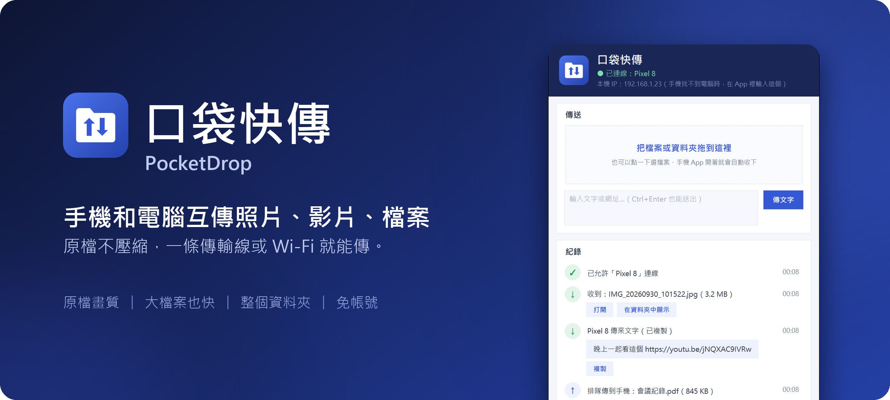
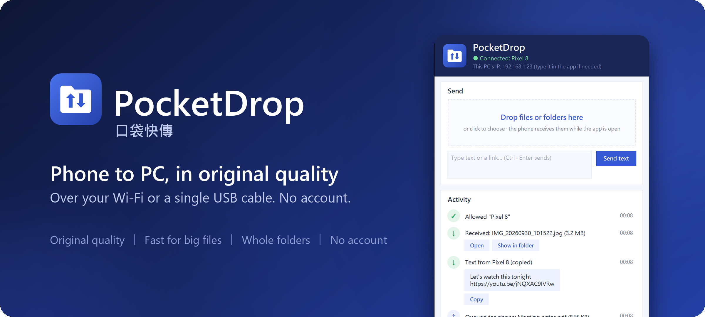

<p align="center"></p>

<p align="center">
<a href="https://github.com/Benjaminwz/pocketdrop/releases/latest/download/PocketDrop-Setup.exe"></a>&nbsp;&nbsp;
<a href="https://github.com/Benjaminwz/pocketdrop/releases/latest/download/PocketDrop.apk"></a>&nbsp;&nbsp;
<a href="#三步開始用"></a>
</p>

<p align="center"><sub>免費、開放原始碼，不用註冊任何帳號。　<a href="#english">English</a></sub></p>

## 為什麼不用 LINE 傳給自己？

|  | 口袋快傳 | LINE 傳給自己 |
|---|---|---|
| **畫質** | 原檔，一點都不壓縮 | 照片、影片預設會壓縮 |
| **速度** | 在家裡的 Wi-Fi 或傳輸線上直接傳，大檔案快很多 | 先上傳到網路再下載回來 |
| **大檔案** | 沒有大小限制，幾十 GB 的影片也行 | 檔案有大小上限，放久了會過期 |
| **一次很多檔案** | 整個資料夾拖進去，結構照樣保留 | 不能傳資料夾，要一個一個處理 |
| **存檔** | 自動存進「下載」資料夾 | 要一個一個點開、另存 |
| **文字、網址** | 收到自動複製，直接貼上 | 要打開聊天室長按複製 |
| **隱私** | 在家裡傳，檔案不經過任何伺服器 | 檔案會經過 LINE 的伺服器 |
| **沒網路** | 同一個 Wi-Fi、熱點或傳輸線就能傳，不吃手機流量 | 一定要有網路 |
| **帳號** | 不用 | 電腦要登入 LINE |

**傳給朋友，LINE 還是最方便；傳給自己的手機和電腦，用口袋快傳。**

## 三步開始用

**1. 電腦裝好口袋快傳**

按上面的「下載電腦版」，打開下載的檔案，一直按「下一步」就裝好了。

> 如果跳出藍色的「Windows 已保護您的電腦」，按「其他資訊」→「仍要執行」。這是因為作者沒有花錢買數位簽章，不是病毒。

**2. 連接手機（第一次才要）**

裝好後電腦會自動打開「連接手機」，照畫面做就好：

- **Android：** 用傳輸線接上電腦，手機選「檔案傳輸」，電腦會把 App 放進手機，在手機上點它安裝。也可以用手機掃畫面上的 QR code 下載。
- **iPhone：** 用相機掃畫面上的 QR code 就好，不用裝 App。建議再按 Safari 的「分享 → 加入主畫面」，以後就像 App 一樣打開。

**3. 開始傳**

| 想做什麼 | 怎麼做 |
|---|---|
| 電腦 → 手機 | 把檔案拖進電腦版的視窗 |
| 手機 → 電腦 | 手機打開口袋快傳，按「選照片／檔案」；Android 也可以在相簿按「分享 → 口袋快傳」 |
| 傳文字、網址 | 在輸入框打好按「傳文字」。電腦和 Android 收到會自動複製，直接貼上就行（iPhone 按一下「複製」） |

收到的檔案在「**下載**」資料夾裡的「PocketDrop」。iPhone 要按「下載」，檔案會在「檔案」App 的「下載項目」。

之後只要手機打開口袋快傳，就會自動連上電腦，不用再設定。

## 遇到問題？

<details>
<summary><b>手機找不到電腦</b></summary>

- 確認手機和電腦連的是**同一個 Wi-Fi**。
- 咖啡廳、學校這類公共 Wi-Fi 常常不讓裝置互連，改用**傳輸線**：手機 App 按「用 USB 線連」，照著打開「USB 網路共用」。
- 還是不行：電腦視窗上方有寫「本機 IP」，在手機 App 按「輸入電腦 IP」手動輸入。
</details>

<details>
<summary><b>人不在家，也想傳給家裡的電腦</b></summary>

在電腦版勾「**遠端模式**」，再按「連接手機」重新掃一次 QR code。之後手機用行動網路也連得到家裡的電腦，回家後會自動改用 Wi-Fi。不用註冊任何帳號。
</details>

<details>
<summary><b>沒有 Wi-Fi 的地方</b></summary>

用**傳輸線**（見上面「手機找不到電腦」）；或讓電腦開熱點給手機、手機開熱點給電腦，也能用。
</details>

<details>
<summary><b>別台電腦不想安裝</b></summary>

在那台電腦的瀏覽器打開 `http://你電腦的IP:47850`（IP 寫在口袋快傳視窗上方），就是網頁版，檔案直接拖進網頁就能傳。
</details>

<details>
<summary><b>怎麼更新</b></summary>

有新版時，電腦版右上角會出現「更新」，按一下就好。電腦更新後，手機 App 也會出現「更新 App」。
</details>

<details>
<summary><b>安全嗎？</b></summary>

- 檔案直接在你的手機和電腦之間傳，不會上傳到雲端。遠端模式會經過 Cloudflare，而且有 HTTPS 加密。
- 新手機要在電腦上按「允許」、插傳輸線，或掃電腦螢幕上的 QR code 才能連進來。
- 在家裡的 Wi-Fi 傳輸沒有另外加密，請在自己家或信任的網路使用。更在意隱私的話，可以開「純有線模式」，只接受傳輸線。
</details>

## 還能做什麼

<details>
<summary>點開看全部功能</summary>

- **資料夾也能傳**，電腦對手機、手機對電腦都可以。
- **一次傳給好幾支手機**：在「傳給」勾選要傳給誰，沒開著的手機之後打開會補收。
- **手機傳給手機**：選「傳給」另一支手機，電腦幫忙轉過去（Android、iPhone 混著也行）。
- **電腦傳給電腦**：按「連接電腦」。對方電腦在別的地方的話，兩台都勾「遠端模式」，一台按「複製邀請連結」、另一台貼上就好。
- **完全不用電腦版**：Android App 打開「網頁分享」，同一個 Wi-Fi 的電腦、iPhone 用瀏覽器打開手機顯示的網址，就能直接跟手機互傳。
- **插線就配對**：手機插傳輸線、開「USB 網路共用」，自動配對，不用按任何確認；插著線時會改走傳輸線，又快又穩。
- **純有線模式**：完全不走 Wi-Fi，隱私最高。
- **右鍵傳送**：在檔案上按右鍵 →「傳送到」→ 口袋快傳。
- **中英文介面**，Android App 只有約 40 KB。
</details>

## 給開發者

<details>
<summary>從原始碼執行、打包、運作方式</summary>

### 從原始碼執行

電腦版（Python 3.10+）：

```bash
pip install -r requirements.txt
python pc/pocketdrop.pyw
```

### 打包

先準備好 Android 的工具（JDK 17、Android SDK 的 `build-tools;35.0.0` 和 `platforms;android-35`，不需要 Android Studio 或 Gradle）、`pip install pyinstaller`，以及 [Inno Setup 6](https://jrsoftware.org/isinfo.php)：

```powershell
powershell -ExecutionPolicy Bypass -File build_release.ps1 -Version 1.10.3
```

會做出 `PocketDrop.apk`、`dist\PocketDrop.exe`、`dist\PocketDrop-Setup-1.10.3.exe` 和同一個安裝檔的無版本號副本 `dist\PocketDrop-Setup.exe`（README 的下載連結用它）。發布時四個檔案都要附上。`pc\pocketdrop.pyw` 的 `APP_VERSION` 要跟 `-Version` 一樣；Android 版本碼自動算（1.10.3 → 11003）。只做 App 可以執行 `build_apk.ps1 -Tools <放 jdk-17* 和 sdk 的資料夾>`；第一次會產生簽名金鑰 `android/release.keystore`，請保存好。

### 運作方式

- **找電腦：** 手機用 UDP 廣播 `POCKETDROP?` 到 47852 埠，電腦回覆名字和 HTTP 埠（47850）。之後全部走 HTTP。
- **配對：** 第一次連線（`/api/hello`）電腦會跳出詢問，允許後發一把鑰匙給手機。從 USB 網路共用的網卡（RNDIS／NCM）進來的連線直接配對；QR code 裡帶 10 分鐘有效的配對碼，也直接配對。
- **電腦 → 手機：** 長輪詢（`/api/poll`），每一項記著要給哪幾支手機、哪幾支收過了。
- **遠端模式：** 電腦執行 `cloudflared tunnel --url`（免帳號的臨時通道），網址會變，所以登記在 ntfy.sh 的隨機頻道，手機自己去查。上傳切成 32 MB 一段（Cloudflare 單次上限 100 MB）。iPhone 走 GitHub Pages 上的 [固定入口](https://benjaminwz.github.io/pocketdrop/go/)；Android 用 `pocketdrop://pair?…` 叫出 App。
- **純有線模式：** 電腦在收到連線的第一時間就關掉非 USB 的連線，UDP 搜尋也不回應。
- **網頁版：** 電腦版在 `/web` 提供同一套 API 的網頁；Android 的「網頁分享」用 `ServerSocket` 實作同一套 API 的子集，網頁是打包進 APK 的同一份 `web.html`。
- **更新：** 電腦版問 GitHub `releases/latest`，核對 SHA-256 後安裝；手機 App 從電腦下載新版，交給系統的 PackageInstaller。
- **手機存檔：** 用 MediaStore 存到「下載」，不需要儲存權限。
</details>

---

<a name="english"></a>

## English

<p align="center"></p>

**PocketDrop** sends photos, videos, files and text between your phone and your PC. No account, no setup: install it and it works. Android and iPhone.

**Why not just message it to yourself?**
- **Original quality:** chat apps usually compress photos and videos; PocketDrop never does.
- **Faster:** files go straight over your home Wi-Fi or a USB cable instead of up to the internet and back.
- **No size limit, whole folders:** send a 50 GB video or a folder of 1,000 photos with its structure intact.
- **Saved automatically** to Downloads, and received text is already on your clipboard.
- **Private and offline:** at home nothing passes through anyone's server, and it works with no internet at all.

<p align="center">
<a href="https://github.com/Benjaminwz/pocketdrop/releases/latest/download/PocketDrop-Setup.exe"></a>&nbsp;&nbsp;
<a href="https://github.com/Benjaminwz/pocketdrop/releases/latest/download/PocketDrop.apk"></a>
</p>

<p align="center"><sub>iPhone needs no app: scan the QR code shown by the PC app.</sub></p>

1. **Install on your PC.** If Windows shows "Windows protected your PC", click *More info → Run anyway* (the installer isn't code-signed).
2. **Connect your phone (first time only).** The app opens a "Connect a phone" guide. Android: plug in the cable (File transfer) and the app is copied to your phone, or scan the QR code. iPhone: scan the QR code with the camera, then *Share → Add to Home Screen*.
3. **Send.** Drag files onto the PC window to send them to your phone. On the phone, tap *Photos / files*, or use *Share → PocketDrop* on Android. Received files go to *Downloads/PocketDrop*.

**Trouble?** Phone and PC must be on the same Wi-Fi. Public Wi-Fi often blocks this, so use the USB cable instead (*Use USB cable* in the app). Away from home? Tick **Remote mode** on the PC and scan the QR code again. It needs no account.

More: whole folders, sending to several phones at once, phone-to-phone and PC-to-PC, a browser version for PCs without the app, USB auto-pairing, a cable-only privacy mode, and one-click updates. Wi-Fi transfers stay on your local network (plain HTTP). Remote mode goes through Cloudflare over HTTPS.

## License

[MIT](LICENSE)
